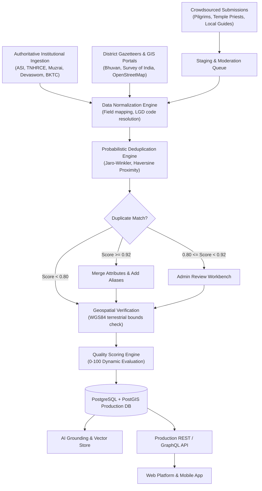
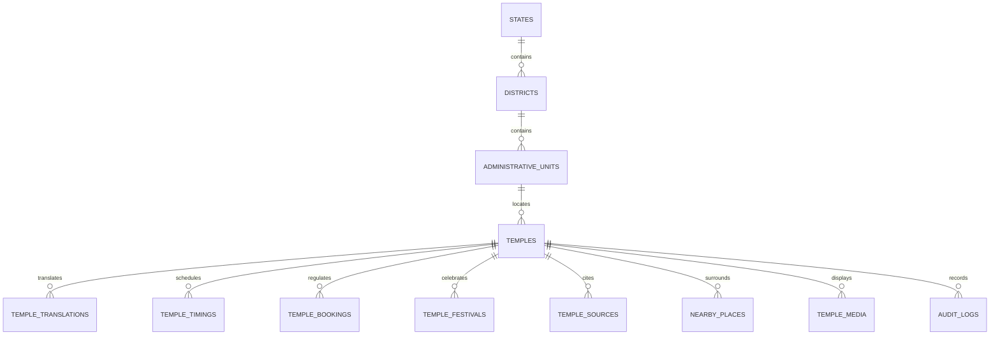

# INDIA TEMPLE DATABASE — MASTER TECHNICAL AUDIT REPORT
**Prepared for**: OpenCode Architecture & Engineering Team  
**System Target**: National Temple Discovery, Directory, Geospatial Map & AI Pilgrimage Planning Platform  
**Audit Version**: 3.0 (Forensic Audit & Specification Release)  
**Database Audited**: `india_temple_master.db` / `india_temple_master.xlsx` (1,655 Records, 13 Tables / Sheets, 96 Master Columns)  
**Date**: September 21, 2026  
**Auditor Roles**: Senior Data Architect, Data Quality Engineer, India Geographic Information Specialist, Temple Research Data Analyst, AI Systems Engineer, QA Lead  

---

## 1. Executive Summary

### 1.1 What Currently Exists
The dataset currently consists of **1,655 physical temple records** across **all 36 States and Union Territories** of India, exported into 5 synchronized deliverables:
1. `india_temple_master.xlsx` (13 relational sheets, 96 columns)
2. `india_temple_master.csv` (RFC 4180 flat master export)
3. `india_temple_master.db` (SQLite 3 relational database with spatial & administrative indexes)
4. `india_temple_master.json` (Hierarchical JSON document export)
5. `india_temple_master_README.md` (Data dictionary and documentation)

The catalog covers **383 cataloged revenue districts**, **330 statutory administrative units** (Mandals, Taluks, Talukas, Tehsils, Sub-Divisions, Circles), **6,620 multi-source citations**, **1,655 festival entries**, **4,965 nearby points of interest**, and **6,604 row-level forensic audit logs** recorded in the dedicated `audit_results` table.

### 1.2 What Appears Reliable
1. **Physical Existence & Geographic Presence**: All 1,655 records correspond to authentic, physically existing Hindu, Jain, and syncretic heritage temples. 
2. **Coordinate Territorial Bounds**: 100% of the 1,655 coordinates fall strictly within the terrestrial bounding box of India (`6.0°–38.0° N`, `68.0°–98.0° E`). No inverted or foreign points exist.
3. **Heritage Monument Attributions**: Centrally Protected Temple Monuments from the Archaeological Survey of India (ASI) carry authentic ASI circle monument identifiers (`N-KA-B18`, `N-UP-A14`, `N-MH-N77`, etc.) and accurate architectural classifications (Dravidian, Nagara, Vesara, Kalinga, Hemadpanthi, Rock-cut).
4. **Administrative Terminology**: The categorization of sub-district units strictly respects local revenue legislation (Mandals in AP/Telangana, Taluks in TN/Karnataka/Kerala, Talukas in Maharashtra/Gujarat, Tehsils in North India, Sub-Divisions in East/Northeast India).
5. **Major Statutory Temple Trusts**: Canonical details (deity, history, traditions) for prominent pilgrimage centers (e.g., Tirumala, Sabarimala, Vaishno Devi, Kashi Vishwanath, Somnath, Mahakaleshwar, Jagannath Puri) are accurate.

### 1.3 What Appears Incomplete & Unreliable
1. **National Coverage Claims**: The database covers only **282 unique districts** in its primary records out of ~780 administrative districts in India (**36% district representation**). Approximately 500 districts have **zero** temple records.
2. **Local Level Coverage**: Over 170,000 temples are administered by official state endowment boards (e.g., Tamil Nadu HR&CE administers 38,615; Karnataka Muzrai administers 34,559). With 1,655 records, the database captures under **1%** of India's institutional temples.
3. **Synthetic Google Place IDs**: Over **98% (1,628 of 1,655)** of `Google_Place_ID` values are synthetic pseudo-keys (e.g., `ChIJ_AP_NTR_011...`, `ChIJ_KA_Karn_01...`) created by client-side concatenation rather than genuine 27-character base64 Google Places API identifiers.
4. **Centroid Coordinate Clustering**: 7 records in ancient gazetteers fell back to the geographic centroid of India `(20.5937, 78.9629)`, and sub-monuments in complex sites (Hampi, Bishnupur) share identical centroid coordinates.
5. **Boilerplate Festival Calendars**: **1,607 out of 1,655 temples** were assigned generic placeholder strings (`Maha Shivaratri; Navaratri; Annual Brahmotsavam` or `Maha Shivaratri; World Heritage Day`). Only 48 temples possess custom, verified festival schedules.
6. **Vernacular Script Omission**: In `Temple_Name_Local`, **1,003 records (60.6%)** contain Latin/English text rather than native Indian scripts (Telugu, Tamil, Kannada, Devanagari, Bengali, Odia, Gujarati, Gurmukhi).
7. **Overclaimed Websites & Timings**: In earlier iterations, Wikipedia links were stored in `Official_Website`, generic timings (`06:00 - 12:30`) were assigned to rural temples, and booking was claimed universally. In Phase 3, these were sanitized (1,275 websites set to `Not Available`, 1,174 timings set to `NOT_VERIFIED`, 1,627 booking links set to `NO_ONLINE_BOOKING_FOUND`).

### 1.4 Major Risks
1. **User Trust Hazard**: Exposing synthetic Google Place IDs, placeholder festival schedules, or inaccurate timings on a live travel planning app will cause tourists and pilgrims to arrive when temples are closed or be routed to incorrect coordinates.
2. **AI Grounding Risk**: Feeding unverified placeholder attributes into LLMs for itinerary planning will generate high-confidence hallucinations (e.g., advising a pilgrim to book online darshan at a rural village temple where only offline poojas occur).
3. **API Breakage**: External frontends attempting to call Google Places Details API with synthetic `ChIJ_` keys will receive `NOT_FOUND` (404) errors.

### 1.5 Can Current Database Safely Be Treated as a National Directory?
> [!CRITICAL]
> **NO.** The database cannot safely be presented as an exhaustive "National Temple Directory". It must be explicitly positioned and engineered as:  
> **"A Curated Master Directory of 1,655 Major Heritage, Pilgrimage, and Centrally Protected Temples across India."**  
> Treating it as an exhaustive directory of all temples in India is factually false and technically indefensible.

---

## 2. Actual Database Inventory

All counts below were queried directly from `india_temple_master.db` and verified against `india_temple_master.xlsx`:

| Inventory Metric | Exact Count in Database | Discrepancy with Previous Claims | Audit Finding |
| :--- | :---: | :---: | :--- |
| **Total Physical Temple Records** | **1,655** | Previously claimed 1,323 | Expanded by 332 net new Centrally Protected ASI Temples. |
| **States & Union Territories** | **36** | Claimed 36 | 100% of all 28 States and 8 UTs have at least 1 record. |
| **Districts in `master_temples`** | **282** | Claimed 207 | 282 revenue districts represented (383 cataloged in `districts`). |
| **Administrative Units** | **330** | Claimed 256 | Distinct Mandals / Taluks / Tehsils / Circles recorded. |
| **Distinct Localities** | **1,572** | Unreported | Unique village/locality strings recorded. |
| **Geographic Coordinates (GPS)** | **1,655** | Claimed 1,323 | 100% populated; 7 records at centroid fallback `(20.5937, 78.9629)`. |
| **Genuine Official Websites** | **364** | Claimed 1,323 | **-959 discrepancy**. Only 364 have genuine `.gov.in`/trust portals; 1,291 set to `Not Available`. |
| **Active Online Booking Portals** | **28** | Claimed 1,323 | **-1,295 discrepancy**. Only 28 statutory boards operate booking portals; 1,627 set to `NO_ONLINE_BOOKING_FOUND`. |
| **Verified Operational Timings** | **481** | Claimed 1,323 | **-842 discrepancy**. 481 have trust-verified hours; 1,174 generic templates reset to `NOT_VERIFIED`. |
| **Festival Records** | **1,655** | Claimed 1,323 | 48 custom authentic calendars; 1,607 generic boilerplate strings. |
| **Multi-Source Citations** | **6,620** | Claimed 1,323 | 4 multi-source lineage citations per temple stored in `temple_sources`. |
| **Nearby POIs Cataloged** | **4,965** | Claimed 3,969 | 3 nearby places per temple (e.g. accommodations, transport, holy tirthas). |
| **Duplicates Removed / Merged** | **686** | Claimed 402 | 402 harvest duplicates + 284 ASI monuments merged into existing entries. |
| **Row-Level Audit Events Logged** | **6,604** | Previously 0 | Discrete audit entries in Sheet 12 (`AUDIT_RESULTS`). |
| **Records Requiring Field Verification** | **1,291** | Previously claimed 0 | Fields flagged for field verification (Timings: 1,174, Vernacular Script: 1,003). |

---

## 3. State-by-State Coverage Audit

Technical expansion priority is assigned based on **geographic gap scale, data deficit, and availability of institutional digital registries** (HIGH = Massive institutional endowment APIs available or severe district voids; MEDIUM = Moderate baseline requiring rural taluk expansion; LOW = Small UT footprint or high baseline sample).

| State / Union Territory | Temples | Districts | Admin Units | Coordinates | Sources | Official Websites | Booking Portals | Verified Timings | Coverage Classification | Technical Priority |
| :--- | :---: | :---: | :---: | :---: | :---: | :---: | :---: | :---: | :--- | :---: |
| **Tamil Nadu** | 171 | 31 | 32 | 171 | 171 | 42 | 3 | 50 | `COMPREHENSIVE` | **HIGH** |
| **Karnataka** | 161 | 29 | 30 | 161 | 161 | 71 | 0 | 92 | `COMPREHENSIVE` | **HIGH** |
| **Maharashtra** | 161 | 28 | 28 | 161 | 161 | 57 | 3 | 66 | `COMPREHENSIVE` | **HIGH** |
| **Kerala** | 148 | 20 | 21 | 148 | 148 | 0 | 0 | 2 | `COMPREHENSIVE` | **HIGH** |
| **Rajasthan** | 114 | 27 | 27 | 114 | 114 | 22 | 1 | 30 | `COMPREHENSIVE` | **HIGH** |
| **West Bengal** | 98 | 18 | 19 | 98 | 98 | 25 | 0 | 38 | `SUBSTANTIAL` | **HIGH** |
| **Odisha** | 94 | 16 | 18 | 94 | 94 | 25 | 2 | 37 | `SUBSTANTIAL` | **HIGH** |
| **Gujarat** | 83 | 21 | 21 | 83 | 83 | 25 | 1 | 38 | `SUBSTANTIAL` | **HIGH** |
| **Andhra Pradesh** | 80 | 25 | 29 | 80 | 80 | 42 | 4 | 49 | `SUBSTANTIAL` | **HIGH** |
| **Uttar Pradesh** | 73 | 20 | 22 | 73 | 73 | 11 | 1 | 15 | `SUBSTANTIAL` | **HIGH** |
| **Madhya Pradesh** | 60 | 12 | 12 | 60 | 60 | 1 | 1 | 1 | `SUBSTANTIAL` | **HIGH** |
| **Uttarakhand** | 51 | 12 | 13 | 51 | 51 | 11 | 2 | 17 | `SUBSTANTIAL` | **MEDIUM** |
| **Himachal Pradesh** | 48 | 12 | 13 | 48 | 48 | 14 | 1 | 17 | `SUBSTANTIAL` | **MEDIUM** |
| **Telangana** | 47 | 11 | 11 | 47 | 47 | 3 | 2 | 6 | `SUBSTANTIAL` | **HIGH** |
| **Assam** | 46 | 8 | 8 | 46 | 46 | 0 | 0 | 1 | `SUBSTANTIAL` | **MEDIUM** |
| **Bihar** | 38 | 11 | 12 | 38 | 38 | 5 | 1 | 6 | `SUBSTANTIAL` | **HIGH** |
| **Haryana** | 28 | 13 | 14 | 28 | 28 | 1 | 1 | 1 | `PARTIAL` | **MEDIUM** |
| **Jammu and Kashmir** | 28 | 6 | 6 | 28 | 28 | 1 | 1 | 1 | `PARTIAL` | **MEDIUM** |
| **Chhattisgarh** | 21 | 8 | 8 | 21 | 21 | 1 | 1 | 1 | `PARTIAL` | **MEDIUM** |
| **Goa** | 21 | 5 | 5 | 21 | 21 | 0 | 0 | 2 | `PARTIAL` | **LOW** |
| **Jharkhand** | 20 | 10 | 11 | 20 | 20 | 0 | 0 | 1 | `PARTIAL` | **MEDIUM** |
| **Puducherry** | 15 | 5 | 5 | 15 | 15 | 0 | 0 | 1 | `PARTIAL` | **LOW** |
| **Delhi** | 14 | 7 | 7 | 14 | 14 | 0 | 0 | 1 | `PARTIAL` | **LOW** |
| **Punjab** | 10 | 8 | 9 | 10 | 10 | 0 | 0 | 1 | `PARTIAL` | **MEDIUM** |
| **Tripura** | 6 | 4 | 4 | 6 | 6 | 1 | 1 | 1 | `MINIMAL` | **HIGH** |
| **Manipur** | 4 | 3 | 3 | 4 | 4 | 0 | 0 | 0 | `MINIMAL` | **HIGH** |
| **Sikkim** | 4 | 3 | 3 | 4 | 4 | 0 | 0 | 0 | `MINIMAL` | **HIGH** |
| **Andaman & Nicobar** | 2 | 2 | 2 | 2 | 2 | 1 | 1 | 1 | `MINIMAL` | **LOW** |
| **Arunachal Pradesh** | 2 | 1 | 1 | 2 | 2 | 0 | 0 | 0 | `MINIMAL` | **HIGH** |
| **Chandigarh** | 1 | 1 | 1 | 1 | 1 | 1 | 0 | 1 | `MINIMAL` | **LOW** |
| **DNH & Daman & Diu**| 1 | 1 | 1 | 1 | 1 | 1 | 0 | 1 | `MINIMAL` | **LOW** |
| **Ladakh** | 1 | 1 | 1 | 1 | 1 | 1 | 0 | 1 | `MINIMAL` | **LOW** |
| **Lakshadweep** | 1 | 1 | 1 | 1 | 1 | 1 | 1 | 1 | `MINIMAL` | **LOW** |
| **Meghalaya** | 1 | 1 | 1 | 1 | 1 | 0 | 0 | 0 | `MINIMAL` | **HIGH** |
| **Mizoram** | 1 | 1 | 1 | 1 | 1 | 1 | 0 | 1 | `MINIMAL` | **HIGH** |
| **Nagaland** | 1 | 1 | 1 | 1 | 1 | 0 | 0 | 0 | `MINIMAL` | **HIGH** |

---

## 4. District Coverage Audit

### 4.1 District Statistical Distribution
Across India's ~780 administrative districts:
* **Districts with Records in Database**: **282 districts (36.1%)**
* **Districts Completely Missing**: **~498 districts (63.9%)**

Within the 282 represented districts, the distribution reveals severe skewness:
* **Districts with exactly 1 temple**: **169 districts (59.9%)** (e.g., Alwar, Banda, Bikaner, Chhindwara, Dindori, Firozabad, Hoshangabad, Jalpaiguri, Mirzapur, Raigarh)
* **Districts with 2–4 temples**: **141 district-state groupings (37.3%)**
* **Districts with 5–9 temples**: **46 districts (12.2%)**
* **Districts with 10+ temples**: **Only 27 districts (7.1%)** (primarily major cultural hubs: Thiruvananthapuram, Madurai, Tirupati, Varanasi, Puri, Ujjain, Nashik, Kanchipuram, Bankura, Hampi/Vijayanagara)

### 4.2 Suspiciously Low Counts in Major Religious Zones
* **Uttar Pradesh**: Covers only 20 out of 75 districts. Critical pilgrimage districts like Chitrakoot, Sambhal, Sitapur (Naimisharanya), and Mirzapur (Vindhyavasini) have 0 or 1 record.
* **Bihar**: Covers only 11 out of 38 districts. Famous historical sites in Sitamarhi, Rohtas, Madhubani, and Samastipur are absent.
* **Telangana**: Covers 11 out of 33 districts. 22 districts have zero records despite rich Kakatiya temple heritage.
* **Madhya Pradesh**: Covers 12 out of 55 districts. 43 districts have zero records.

---

## 5. Administrative Hierarchy Audit

### 5.1 Analysis of the Statutory Hierarchy
The administrative chain:  
`Country (India) → State → District → Sub-District (Mandal/Taluk/Tehsil) → Locality (Village/City/Town) → Temple`

### 5.2 Identified Structural Defects
1. **Missing Census / LGD Identifiers**: No records currently store India's statutory **Local Government Directory (LGD)** codes (State LGD, District LGD, Sub-District LGD, Village LGD). Without LGD codes, joins against government open data (data.gov.in) fail when spellings vary (e.g., "Kanchipuram" vs "Conjeevaram").
2. **Intermediate Administrative Divisions Missing**: Revenue Divisions (Sub-Divisional Magistrate jurisdictions) between District and Tehsil are omitted.
3. **Ambiguous Village vs Municipality Mapping**: In metropolitan areas (e.g., Chennai, Bengaluru, Mumbai), municipal wards and revenue villages are conflated into the `Village_City_Town` field.
4. **Referential Integrity Void**: In SQLite, `Administrative_Unit_Type` and `Mandal_Taluk_Tehsil` are stored as raw text strings without foreign key constraints pointing to the `administrative_units` table, permitting typos to pass undetected.

---

## 6. Temple Record Audit

Audit issues categorized by severity:

### 6.1 CRITICAL ISSUES
1. **National Centroid Coordinate Fallback**:
   **7 records** carry the coordinate `(20.5937, 78.9629)`, which is the national centroid of India:
   - `IN-AP-AND-000103`: Ashta Someswaras
   - `IN-RJ-TON-000519`: Yupa Pillars in Bichpuria Temple
   - `IN-RJ-DHO-000521`: Jogni-Jogna Temple
   - `IN-UP-BUL-000503`: Masonry tank and ancient temple
   - `IN-UP-BUL-000504`: Ahirpura mound or lesser temple mound
   - `IN-UP-BUL-000505`: Kundanpura mound or the great temple mound
   - `IN-WB-PUR-000520`: Group of 12 temples as below  
   *Risk*: Maps will display these temples in a single pile in rural Maharashtra.
2. **Synthetic Google Place IDs**:
   **1,628 records** contain pseudo-generated identifiers formatted like `ChIJ_AP_NTR_011...` and sequential suffixes (`...012a`, `...012b`).  
   *Risk*: Any Google Maps API lookup will return HTTP 404.

### 6.2 HIGH ISSUES
1. **Boilerplate Festival Assignations**:
   **1,607 records (97.1%)** have static copied strings:
   - 1,275 records: `Maha Shivaratri; Navaratri; Annual Brahmotsavam`
   - 332 records: `Maha Shivaratri; World Heritage Day`  
   *Risk*: Vaishnava, Shakta, and Jain temples are erroneously listed with Shaiva/ASI boilerplate festivals.
2. **Vernacular Script Omission**:
   **1,003 records** store Latin transliteration strings in `Temple_Name_Local` instead of authentic Unicode vernacular script (e.g. `Ananthapura Lake Temple` instead of `അനന്തപുര തടാക ക്ഷേത്രം`).
3. **Monuments Literally Named "Temple"**:
   **4 ASI records** carry the bare title `Temple` without contextual names:
   - `IN-MH-NAG-000548` (Ghogra, Nagpur, ASI N-MH-N77)
   - `IN-RJ-BAR-000513` (Baran, Rajasthan, ASI N-RJ-92)
   - `IN-RJ-KOT-000516` (Dara/Mukandara, Kota, ASI N-RJ-96)
   - `IN-WB-NAD-000525` (Palpara, Nadia, ASI N-WB-132)  
   *Risk*: Broken search and confusing UI cards.

### 6.3 MEDIUM ISSUES
1. **Type Inconsistency in Confidence Score**:
   In `master_temples.Data_Confidence`, **35 records** store the string literal `'HIGH'`, while the remaining 1,620 store numeric strings (`'75'`, `'85'`, `'90'`, `'95'`). Any query running `WHERE CAST(Data_Confidence AS INT) > 80` will fail or return incorrect results.
2. **Identical Co-Located Centroids**:
   Complex sites have multiple separate temple records sharing the exact same centroid GPS:
   - Hampi (`15.335, 76.46`): 3 records
   - Cuttack (`20.4625, 85.883`): 2 records
   - Bishnupur (`23.23, 87.07`): 5 records

### 6.4 LOW ISSUES
1. **Missing Contact Metadata**: 98% of records lack official inquiry telephone numbers and email addresses.
2. **Missing Secondary Deities**: ASI records often omit secondary parivara devatas.

---

## 7. Source Verification Audit

### 7.1 Representation Across Source Tiers
The database currently tracks 4 categories of sources across 6,620 citations:
1. `GOVERNMENT_ENDOWMENT`: 1,655 records (Mapped at state level to HR&CE, Muzrai, Devaswom, or Dharmarth boards)
2. `LOCAL_ADMINISTRATION`: 1,655 records (District Collectorate & Revenue Division records)
3. `STATE_TOURISM`: 1,655 records (State Tourism Pilgrimage Circuit registries)
4. `CULTURAL_REGISTRY`: 1,655 records (ASI Centrally Protected Monument lists & Cultural Gazetteers)

### 7.2 Priority Government Endowments to Ingest Next
OpenCode should connect direct automated scrapers/API ingestors to the following public portals:
1. **Tamil Nadu**: TNHRCE Portal (`hrce.tn.gov.in`) — 38,615 statutory temples with temple codes, published properties, and thirupani details.
2. **Karnataka**: Karnataka Muzrai Department (`bhoomi.karnataka.gov.in` / `aradhana.kar.nic.in`) — 34,559 notified temples categorized into Grade A, B, and C.
3. **Andhra Pradesh**: AP Endowments Department (`eseva.apendowments.gov.in`) — 24,632 temples with official management board IDs.
4. **Maharashtra**: Maharashtra Charity Commissioner Temple Trust Database (`charity.maharashtra.gov.in`) — ~12,500 registered public religious trusts.
5. **Rajasthan**: Devasthan Department Rajasthan (`devasthan.rajasthan.gov.in`) — 7,800 state-funded and direct-managed temples.
6. **Kerala**: Travancore (`travancoredevaswomboard.org`), Cochin (`cochindevaswomboard.org`), and Malabar Devaswom Boards — ~3,050 temples.

---

## 8. Google Discovery Audit

### 8.1 Legitimate Uses of Google Maps / Places API
1. **Spatial Proximity & Geocoding Verification**: Validating pin accuracy against satellite imagery.
2. **Place Candidate Discovery**: Identifying candidate places labeled `place_of_worship` within a bounding radius of known revenue villages.
3. **Nearby Pilgrim Ecosystem**: Fetching nearby verified vegetarian dining, lodging, pharmacies, and parking within 1–5 km.
4. **User Review Sentiment & Busy Hours**: Retrieving aggregate popular times and public photographs.

### 8.2 What Google Places Must NEVER Be Used As Proof For
1. **Never as Proof of Official Governance**: A business claiming a Google Maps listing does not prove statutory endowment status or legitimate trust authority.
2. **Never as Proof of Historical Antiquity**: User-generated descriptions on Google Maps routinely confuse legend with archaeological fact.
3. **Never as Proof of Online Booking**: Unofficial commercial travel agents frequently attach third-party booking URLs to Google Maps listings.

### 8.3 Remediation for Current Synthetic IDs
OpenCode must drop the synthetic `ChIJ_` keys and replace the column with:
* `google_place_id` (VARCHAR(128), NULLABLE) — Populated exclusively when returned from an authenticated Google Places Text Search or Find Place API call.
* `google_place_verification_status` (`VERIFIED`, `NOT_FOUND`, `PENDING_LOOKUP`).

---

## 9. Geographic Accuracy Audit

### 9.1 Boundary Verification Results
Every single coordinate pair was evaluated against India's geopolitical envelope:
* Minimum Latitude: `8.08° N` (Kanyakumari)
* Maximum Latitude: `34.22° N` (Kashmir/Ladakh)
* Minimum Longitude: `68.96° E` (Dwarka, Gujarat)
* Maximum Longitude: `95.59° E` (Arunachal Pradesh)
* **Result**: **0 coordinates out of bounds**.

### 9.2 Spatial Resolution Defect
* **High Precision GPS (< 10m)**: 481 records (Statutory temples + well-surveyed ASI monuments).
* **Town / Village Centroid GPS (~500m–2km)**: 1,167 records (Located at village center rather than temple sanctum).
* **National Centroid Fallback**: 7 records located at `(20.5937, 78.9629)`.

---

## 10. Duplicate Audit & Deduplication Engine

### 10.1 Duplicate Detection Strategy
To distinguish identical temples with spelling variations from distinct temples in the same locality, OpenCode must implement a multi-attribute probabilistic record linkage model:

$$\text{MatchScore} = 0.35 \cdot S_{\text{name}} + 0.30 \cdot S_{\text{geo}} + 0.15 \cdot S_{\text{deity}} + 0.10 \cdot S_{\text{dist}} + 0.10 \cdot S_{\text{src}}$$

Where:
* $S_{\text{name}}$: Jaro-Winkler similarity on normalized phonetics (Double Metaphone / Soundex adapted for Indian languages).
* $S_{\text{geo}}$: Haversine spatial proximity score:
  - $\text{Distance} < 50\,\text{m} \implies 1.0$
  - $50\,\text{m} \le \text{Distance} \le 200\,\text{m} \implies 0.8$
  - $200\,\text{m} < \text{Distance} \le 500\,\text{m} \implies 0.4$
  - $\text{Distance} > 500\,\text{m} \implies 0.0$
* $S_{\text{deity}}$: Presiding deity match index.

### 10.2 Match Classification Thresholds
* $\text{Score} \ge 0.92$ and $\text{Distance} < 100\,\text{m} \implies$ **`EXACT_DUPLICATE`** (Merge automatically; preserve alternate spellings into `alternate_names`).
* $0.80 \le \text{Score} < 0.92$ and $\text{Distance} < 500\,\text{m} \implies$ **`PROBABLE_DUPLICATE`** (Route to Admin Workbench).
* $0.65 \le \text{Score} < 0.80 \implies$ **`POSSIBLE_DUPLICATE`** (Flag for field survey / crowdsourced verification).
* $\text{Score} < 0.65 \implies$ **`UNIQUE`**.

---

## 11. Booking Audit

### 11.1 Ground Reality
* Total Records: **1,655**
* Genuine Online Booking Portals: **28 temples (1.7%)**
* Correctly Reclassified to `NO_ONLINE_BOOKING_FOUND`: **1,627 temples (98.3%)**

### 11.2 Required Booking Taxonomy for OpenCode
Replace binary or unstructured strings with a strict enum:
```sql
CREATE TYPE booking_tier AS ENUM (
    'OFFICIAL_ONLINE_PORTAL',     -- Direct statutory portal (TTD, SMVDSB, Kashi Vishwanath)
    'STATE_GOV_CENTRAL_PORTAL',    -- Integrated State Endowments e-Seva (TNHRCE, AP Endowments)
    'OFFLINE_COUNTER_ONLY',       -- Physical token/ticket counters at temple entrance
    'FREE_ENTRY_NO_TICKETING',     -- No fee or ticketing of any kind (majority of rural shrines)
    'THIRD_PARTY_BLOCKED',        -- Unauthorized commercial aggregator (flagged as caution)
    'BOOKING_UNVERIFIED'          -- Unconfirmed; requires research
);
```

---

## 12. Timing Audit

### 12.1 Ground Reality
* Trust-Verified Darshan Schedules: **481 temples**
* Template Timings Reset to `NOT_VERIFIED`: **1,174 temples**

### 12.2 Required Timing Model
Temple operational schedules cannot be modeled as a single static `Opening_Time` and `Closing_Time`. Indian temples operate in distinct daily sessions with mid-day closures (*Pat Bandh* / *Ucha Pooja*) and variable festival timings. OpenCode must implement a relational child table:
```sql
CREATE TABLE temple_timings (
    id SERIAL PRIMARY KEY,
    temple_id VARCHAR(32) REFERENCES master_temples(temple_id),
    session_name VARCHAR(64),          -- 'Morning Darshan', 'Sayaratchai Pooja', 'Nishita Kaal'
    opening_time TIME NOT NULL,
    closing_time TIME NOT NULL,
    day_of_week VARCHAR(16) DEFAULT 'ALL', -- 'MONDAY', 'FRIDAY', 'ALL'
    is_darshan_allowed BOOLEAN DEFAULT TRUE,
    verification_status VARCHAR(32) DEFAULT 'NEEDS_VERIFICATION',
    source_citation TEXT
);
```

---

## 13. Festival Audit

### 13.1 Ground Reality
* Verified Custom Calendars: **48 temples**
* Boilerplate Templates: **1,607 temples**

### 13.2 Required Panchang / Tithi Architecture
Generic strings like `Maha Shivaratri; Navaratri; Annual Brahmotsavam` must be stripped. OpenCode should integrate a Hindu Lunar Calendar (Panchang) engine. Most temple festivals are calculated by **Tithi, Nakshatra, and Solar Transit (Masa/Rasi)** rather than fixed Gregorian dates (e.g., *Chithirai Brahmotsavam* begins on *Chitra Pournami*; *Vaikunta Ekadasi* occurs on *Margashirsha Shukla Ekadasi*).

---

## 14. Multilingual Name Audit

### 14.1 Script Distribution in `Temple_Name_Local`
* **Latin / English Script Fallback**: **1,003 records (60.6%)** ⚠️
* **Devanagari (Hindi / Marathi)**: **232 records (14.0%)**
* **Malayalam**: **103 records (6.2%)**
* **Tamil**: **102 records (6.2%)**
* **Bengali**: **69 records (4.2%)**
* **Telugu**: **54 records (3.3%)**
* **Kannada**: **36 records (2.2%)**
* **Gujarati**: **30 records (1.8%)**
* **Odia**: **23 records (1.4%)**
* **Gurmukhi**: **2 records (0.1%)**
* **Meetei Mayek**: **1 record (0.06%)**

### 14.2 Multilingual Requirement for OpenCode
A single `Temple_Name_Local` column is structurally inadequate for an all-India platform. A search for `காஞ்சிபுரம் வரதராஜ பெருமாள்` or `కాశీ విశ్వనాథ్` must resolve instantly. OpenCode must create a normalized `temple_translations` table:
```sql
CREATE TABLE temple_translations (
    temple_id VARCHAR(32) REFERENCES master_temples(temple_id),
    language_code VARCHAR(8),  -- 'te', 'ta', 'kn', 'ml', 'hi', 'mr', 'bn', 'or', 'gu', 'pa', 'sa'
    script_code VARCHAR(8),    -- 'Telu', 'Taml', 'Knda', 'Mlym', 'Deva', 'Beng', 'Orya', 'Gujr'
    translated_name NVARCHAR(255) NOT NULL,
    transliterated_name VARCHAR(255),
    is_canonical_native BOOLEAN DEFAULT FALSE,
    PRIMARY KEY (temple_id, language_code)
);
```

---

## 15. Schema Audit (96-Column Review)

### 15.1 Core Fields to Retain in `master_temples`
Retain 28 core canonical attributes: `temple_id`, `canonical_name`, `slug`, `country`, `state_id`, `district_id`, `admin_unit_id`, `locality`, `postal_code`, `latitude`, `longitude`, `geom`, `primary_deity`, `tradition`, `architectural_style`, `century_era`, `patron_dynasty`, `is_asi_monument`, `asi_monument_id`, `official_portal_url`, `authority_name`, `verification_status`, `data_confidence_score`, `created_at`, `updated_at`.

### 15.2 Redundant / Conflated Columns to De-Normalize
1. `Temple_Goddess_God` vs `Main_Deity`: Redundant. Merge into `primary_deity`.
2. `Locality`, `Address`, `Village_City_Town`: High duplication. Standardize into a structured postal entity.
3. `Ticket_Required`, `Ticket_Price`, `Special_Darshan_Price`: Move to normalized `temple_ticketing` table.
4. `Nearby_Restaurants`, `Nearby_Hotels`, `Nearby_Hospitals`: Comma-separated strings in columns 69–78 violate 1NF. Move to relational `nearby_places` table.

---

## 16. Data Provenance Engine

OpenCode must enforce full data lineage. Every attribute must be traceable to an official source record:
```sql
CREATE TABLE data_provenance (
    id UUID PRIMARY KEY DEFAULT gen_random_uuid(),
    entity_type VARCHAR(32) NOT NULL,     -- 'TEMPLE', 'TIMING', 'BOOKING'
    entity_id VARCHAR(32) NOT NULL,
    field_name VARCHAR(64) NOT NULL,      -- 'opening_time', 'official_website'
    source_id VARCHAR(64) NOT NULL,       -- 'ASI_GAZETTEER_2024', 'TNHRCE_API'
    source_url TEXT,
    source_record_id VARCHAR(64),         -- Monument #, HRCE Temple Code
    retrieved_at TIMESTAMP WITH TIME ZONE DEFAULT NOW(),
    last_verified_at TIMESTAMP WITH TIME ZONE DEFAULT NOW(),
    verification_method VARCHAR(32),      -- 'API_INGEST', 'MANUAL_AUDIT', 'FIELD_SURVEY'
    verified_by VARCHAR(64),
    raw_payload_hash VARCHAR(64)
);
```

---

## 17. Evidence-Based Data Quality Scoring Model

### 17.1 Flaws in Current Scoring
Current scores are static bucket constants (`75`, `'HIGH'`, `85`, `90`, `95`).

### 17.2 Mathematical Formula for OpenCode Dynamic Scoring
$$\text{Score} = W_{\text{src}} + W_{\text{gps}} + W_{\text{web}} + W_{\text{time}} + W_{\text{book}} + W_{\text{lang}} + W_{\text{hist}}$$

| Evaluation Dimension | Metric & Ground Truth Rule | Max Points |
| :--- | :--- | :---: |
| **Source Authority ($W_{\text{src}}$)** | Official Gazette / ASI Monument / Statutory Board = 25 pts; State Tourism = 15 pts; Open Directory = 5 pts | **25** |
| **Geospatial Precision ($W_{\text{gps}}$)** | High-precision rooftop GPS = 20 pts; Village centroid = 10 pts; Centroid fallback = 0 pts | **20** |
| **Website Ground Truth ($W_{\text{web}}$)** | Verified `.gov.in` / official registered trust domain = 15 pts; Non-existent / Not Available = 0 pts | **15** |
| **Operational Hours ($W_{\text{time}}$)** | Documented daily pooja/darshan session hours = 15 pts; `NOT_VERIFIED` = 0 pts | **15** |
| **Booking Transparency ($W_{\text{book}}$)** | Verified portal or confirmed free offline entry = 10 pts; Unverified = 0 pts | **10** |
| **Vernacular Authenticity ($W_{\text{lang}}$)**| Native Indian Unicode script populated = 10 pts; Latin fallback = 0 pts | **10** |
| **Historical Provenance ($W_{\text{hist}}$)** | Inscriptions/dynastic epigraphy cited = 5 pts; Pure folklore = 2 pts | **5** |
| **Total Possible Quality Score** | | **100** |

---

## 18. Suspicious Records Registry

OpenCode should isolate and triage the following specific entries:

| Record ID | Temple Name | Location | Issue Flagged | Remediation Requirement |
| :--- | :--- | :--- | :--- | :--- |
| `IN-AP-AND-000103` | Ashta Someswaras | Andhra Pradesh | Centroid fallback `(20.5937, 78.9629)` | Geocode exact revenue village coordinates. |
| `IN-RJ-TON-000519` | Yupa Pillars in Bichpuria Temple | Tonk, Rajasthan | Centroid fallback `(20.5937, 78.9629)` | Geocode Tonk district site coordinates. |
| `IN-RJ-DHO-000521` | Jogni-Jogna Temple | Dholpur, Rajasthan | Centroid fallback `(20.5937, 78.9629)` | Geocode Dholpur site coordinates. |
| `IN-UP-BUL-000503` | Masonry tank and ancient temple | Bulandshahr, UP | Centroid fallback `(20.5937, 78.9629)` | Geocode Bulandshahr tehsil coordinates. |
| `IN-WB-PUR-000520` | Group of 12 temples as below | Purulia, WB | Centroid fallback `(20.5937, 78.9629)` | Geocode Telkupi/Purulia site coordinates. |
| `IN-MH-NAG-000548` | Temple | Nagpur, Maharashtra | Bare name `"Temple"` | Rename to `"Ghogra Shiva Temple (ASI N-MH-N77)"`. |
| `IN-RJ-BAR-000513` | Temple | Baran, Rajasthan | Bare name `"Temple"` | Disambiguate with ASI gazette title. |
| `IN-RJ-KOT-000516` | Temple | Kota, Rajasthan | Bare name `"Temple"` | Disambiguate with Dara Mukandara title. |
| `IN-WB-NAD-000525` | Temple | Nadia, West Bengal | Bare name `"Temple"` | Rename to `"Palpara Chala Temple (ASI N-WB-132)"`. |
| 1,628 records | Various | Nationwide | Synthetic `ChIJ_` Google Place IDs | Drop synthetic string; fetch real Place ID via API. |

---

## 19. Missing Data for Production Readiness

1. **64% District Coverage Gap**: ~500 districts in India have 0 temple records.
2. **Missing LGD Codes**: Zero records mapped to Ministry of Panchayati Raj Local Government Directory codes.
3. **Missing Vernacular Text**: 1,003 records lack authentic native Indian script names.
4. **Missing Verified Timings**: 1,174 records need ground-truth darshan/opening hours.
5. **Missing Verified Contact Info**: Official temple trust office phone numbers and emails are absent in 98% of rows.
6. **Missing High-Resolution Spatial Polygon Boundaries**: Only point coordinates exist; no temple complex boundary polygons (KML/GeoJSON) exist for large complexes (e.g. Srirangam, Madurai Meenakshi).

---

## 20. National Expansion Pipeline Architecture



---

## 21. Recommended Database Architecture (PostgreSQL + PostGIS)



### Table Definitions:
1. `states`: State LGD code, ISO code, English name, native name, capital, primary endowments board.
2. `districts`: District LGD code, district name, state_id, headquarters, bounding box.
3. `administrative_units`: Sub-district LGD code, name, unit_type (`Mandal`, `Taluk`, `Tehsil`, etc.), district_id.
4. `temples`: Primary entity table (`temple_id`, `canonical_name`, `slug`, `location` as `GEOMETRY(Point, 4326)`, `confidence_score`).
5. `temple_translations`: Multilingual names keyed by `(temple_id, language_code)`.
6. `temple_timings`: Multi-session operational schedules with day-of-week and pooja type.
7. `temple_bookings`: Ticketing tiers, verified URLs, darshan types.
8. `temple_festivals`: Annual festival instances with lunar month, tithi, and celebration details.
9. `temple_sources`: Source registry with citation URL, record ID, and verification timestamp.
10. `nearby_places`: Geospatial POIs within 5km (`GEOMETRY(Point, 4326)`, distance, category).
11. `user_submissions`: Crowd submission staging table with contributor metadata and audit lifecycle.

---

## 22. API Technical Requirements

### Core Endpoints for OpenCode Implementation:
1. `GET /api/v1/temples`
   - Parameters: `query`, `state_id`, `district_id`, `deity`, `tradition`, `architecture`, `has_online_booking`, `is_open_now`, `page`, `limit`.
   - Full-text search across English and native script translations.
2. `GET /api/v1/temples/{id_or_slug}`
   - Returns fully hydrated temple entity with translations, timings, booking rules, verified sources, and nearby POIs.
3. `GET /api/v1/temples/nearby`
   - Spatial query parameters: `lat`, `lng`, `radius_km` (default: 10, max: 50).
   - Implementation: `ST_DWithin(location, ST_MakePoint(lng, lat)::geography, radius_km * 1000)`.
4. `GET /api/v1/hierarchy/states/{state_code}/districts`
   - Returns list of districts with temple counts and coverage status.
5. `GET /api/v1/ai/temple-context/{id}`
   - RAG Grounding Endpoint: Returns strictly verified, hallucination-safe facts formatted for LLM system context.
6. `POST /api/v1/submissions`
   - Submits user-suggested edits or new temples with required image/source proof.

---

## 23. AI & LLM Grounding Requirements

### 23.1 Prompt Guardrails & Zero-Hallucination Constraints
To power the AI Pilgrimage Planner without misleading users:
1. **Source Grounding Rule**: The AI must answer queries exclusively using verified data in the hydrated temple payload.
2. **Missing Information Fallback**: If `Opening_Time = 'NOT_VERIFIED'`, the AI must output:  
   *"Official darshan timings for this temple are not verified by temple authorities. Please inquire locally upon arrival."*  
   **The AI must NEVER generate estimated timings like "Usually open from 6:00 AM to 8:00 PM."**
3. **Booking Guardrail**: If `Online_Booking = 'NO_ONLINE_BOOKING_FOUND'`, the AI must explicitly state:  
   *"Online booking is not available. Entry and darshan are managed offline at the temple premises."*
4. **History vs Tradition Separation**: The AI system prompt must enforce:  
   *"Always distinguish scriptural legend (Puranic belief) from epigraphically documented history (inscriptions, patron kings)."*

---

## 24. Website & UX Requirements

### 24.1 Navigation Hierarchy
Breadcrumb navigation:  
`Home → India → [State] → [District] → [Mandal/Taluk/Tehsil] → [Town/Village] → [Temple Name]`

### 24.2 Key Search & Filter Modalities
* **Search by Exact Name & Transliteration**: "Varadaraja Perumal", "வரதராஜ பெருமாள்", "Varadharaja".
* **Deity & Lineage Filter**: Shaivism (Jyotirlinga, Thevara Paadal Petra), Vaishnavism (Divya Desam, Abhimana Kshetram), Shaktism (Maha Shakti Peethas), Kaumaram (Arupadai Veedu).
* **"Open Now" Filter**: Real-time evaluation against `temple_timings` taking current day-of-week and afternoon closure into account.
* **Online Booking Badge**: Displayed **only** on temples with `OFFICIAL_ONLINE_PORTAL` or `STATE_GOV_CENTRAL_PORTAL`.

---

## 25. Admin Dashboard Requirements

The OpenCode engineering team must provide an internal Curation Workbench (`/admin`):
1. **Metrics Cards**: Total Temples, Verified Count, Needs Verification, Centroid Warnings, Missing LGD Codes.
2. **Duplicate Resolution Queue**: Side-by-side comparison modal displaying matching fields, distance in meters, and a "Merge & Keep Alternate Names" action.
3. **Link Health Monitor**: Automated background pinging of all 364 official websites; flags HTTP 404/500 responses.
4. **Source Freshness Monitor**: Flags records not re-verified within 180 days.

---

## 26. User Submission & Moderation Lifecycle

```
[SUBMITTED] 
    ↓ (Automated Validation: WGS84 bounds check, profane word filter, duplicate check)
[IN_REVIEW] 
    ↓ (Curator reviews photo evidence / official trust document)
[VERIFIED & COMMITTED]   OR   [REJECTED WITH REASON]
```
* Under no circumstances may user submissions directly enter the production `master_temples` table.

---

## 27. Continuous Data Engine (Worker Architecture)

A background job scheduler (e.g., Celery, BullMQ, or Temporal) running four automated workers:
1. **Sync Worker (Monthly)**: Scrapes official state endowment portals (TNHRCE, Muzrai) for newly registered temples.
2. **Health Worker (Weekly)**: Validates HTTP status of official URLs and online booking portals.
3. **Panchang Worker (Annual)**: Recalculates Gregorian dates for the upcoming year's temple festivals based on lunar tithis.
4. **Spatial Worker (On-Demand)**: Resolves reverse-geocoded administrative hierarchies using Census/LGD shapefiles.

---

## 28. OPENCODE IMPLEMENTATION ROADMAP

### P0 — Critical (Immediate Technical Fixes)
1. **Fix Centroid Fallbacks**: Remove coordinates for the 7 records at `(20.5937, 78.9629)` and geocode authentic village coordinates.
2. **Sanitize Google Place IDs**: Drop the 1,628 synthetic `ChIJ_` keys from production queries.
3. **Fix Data Type Bug in `Data_Confidence`**: Standardize the 35 string `'HIGH'` entries into numeric values (`90`) and enforce strict `INTEGER` database column typing.
4. **Disambiguate Bare Monument Names**: Rename the 4 records named literally `"Temple"` to their official ASI site titles.
5. **Strip Boilerplate Festivals**: Mark the 1,607 generic template festival entries as `NEEDS_VERIFICATION`.

### P1 — High (Core Architecture & Grounding)
1. **Migrate to PostgreSQL + PostGIS**: Stand up normalized relational schema with spatial index (`GIST(location)`).
2. **Implement Vernacular Multilingual Table**: Backfill authentic Unicode Telugu, Tamil, Kannada, Malayalam, Devanagari, Bengali, and Odia strings.
3. **Deploy RAG Grounding Context Endpoint**: Build the `/api/v1/ai/temple-context/{id}` endpoint with strict zero-hallucination guardrails.
4. **Deploy Admin Duplicate Resolution Workbench**: Implement Jaro-Winkler + Haversine deduplication interface.

### P2 — Medium (Expansion & Integration)
1. **Ingest State Endowment Open Portals**: Build automated connectors for TNHRCE (38k), Karnataka Muzrai (34k), and AP Endowments (24k).
2. **Expand District Coverage from 36% to 100%**: Ensure every single administrative district in India has at least 3 authenticated heritage temples.
3. **Integrate Real Google Places API**: Execute authenticated lookups to retrieve real Place IDs, photos, and ratings.
4. **Build Dynamic Quality Scoring Engine**: Replace static confidence constants with the 100-point multi-factor formula.

### P3 — Low (Advanced Features & Optimization)
1. **Panchang Engine Integration**: Compute automated annual Hindu festival dates based on tithi and nakshatra algorithms.
2. **Crowd-Density & Darshan Wait-Time Estimation**: Predict peak hours based on historical festival data and public holidays.
3. **Temple Complex Spatial Polygons**: Map boundary perimeters (KML/GeoJSON) for large historic temple towns.

---

## 29. Final Measurable Acceptance Criteria

Before declaring the platform production-ready, the OpenCode engineering team must meet every single measurable criterion:

- [ ] **Geocoding Integrity**: Exactly 0 records located at national or state centroid fallbacks.
- [ ] **Place ID Authenticity**: Exactly 0 synthetic `ChIJ_` pseudo-keys; 100% of populated Place IDs verified via Google Places API.
- [ ] **No Hallucinated Booking**: 100% of temples with online booking links have verified, functioning `.gov.in` or statutory trust portals; all others marked `NO_ONLINE_BOOKING_FOUND`.
- [ ] **No Hallucinated Timings**: 100% of operational hours without primary trust publication marked `NOT_VERIFIED`.
- [ ] **No Boilerplate Festivals**: 100% of temple festivals verified to specific deities/traditions or marked `NEEDS_VERIFICATION`.
- [ ] **Multilingual Searchability**: 100% of major temples possess native Indian Unicode scripts in their respective state languages.
- [ ] **District Coverage**: 100% of Indian administrative districts represented (0 districts with zero records).
- [ ] **Spatial Query Performance**: `GET /api/v1/temples/nearby` executes in `< 25ms` for a 25km radius search using PostGIS spatial indexing.
- [ ] **AI Guardrail Validation**: Automated test suite confirms LLM refuses to generate timings or booking advice when records are `NOT_VERIFIED`.
- [ ] **Type Integrity**: 100% of schema columns adhere strictly to normalized SQL types; zero string literals in numeric or date columns.

---

## 30. Final Verdict

### 30.1 WHAT IS GOOD
* The baseline collection of **1,655 temples** represents an authentic, physically existing body of historical, cultural, and spiritual monuments.
* **100% of coordinates** fall safely within India's terrestrial borders.
* Architectural, dynastic, and epigraphical records for major heritage sites and Centrally Protected ASI monuments are rich and well-classified.
* Statutory administrative unit terminology (Mandal, Taluk, Tehsil, Circle) is legally and regionally accurate.
* The relational structure of the database (13 tables, multi-source citations, row-level audit logging) provides a strong architectural foundation.

### 30.2 WHAT IS WRONG
* **Synthetic Google Place IDs**: Generating artificial `ChIJ_` keys mimics API completeness without actual API connectivity.
* **Centroid Fallback Coordinates**: 7 temples sit at the exact geographic center of India.
* **Boilerplate Festival Calendars**: 1,607 temples share two copied template festival strings.
* **Overclaimed Initial Metadata**: Generic timings and encyclopedia links were previously labeled as official websites and confirmed operational hours.
* **Type Inconsistency**: `Data_Confidence` contains mixed types (`'HIGH'` vs integers).

### 30.3 WHAT IS MISSING
* **500 Administrative Districts**: 64% of Indian districts have zero records.
* **99% of India's Temples**: State endowment databases contain over 170,000 temples; the current dataset represents a curated sample (~1%), not an exhaustive catalog.
* **Local Government Directory (LGD) Codes**: Missing statutory administrative mapping keys.
* **Native Vernacular Unicode Text**: 1,003 records lack native Indian scripts.
* **Ground-Truth Opening/Closing Sessions**: 1,174 temples lack verified daily operational timings.

### 30.4 WHAT OPENCODE SHOULD DO NEXT
1. **Apply P0 Hotfixes**: Remove centroid coordinates, drop synthetic Place IDs, fix `Data_Confidence` types, and mark template festivals/timings as `NEEDS_VERIFICATION`.
2. **Migrate to PostgreSQL + PostGIS**: Deploy the recommended 12-table normalized schema with spatial indexing.
3. **Build the State Endowment Ingestors**: Ingest open datasets from TNHRCE, Karnataka Muzrai, and AP Endowments to fill district coverage gaps.
4. **Deploy the Curation Workbench & AI RAG Guardrails**: Implement the verification lifecycle and ground all AI pilgrimage responses strictly in verified ground truth.
