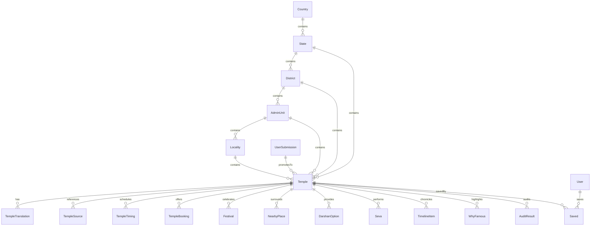

# 🗄️ DEVYATRA — DATABASE ARCHITECTURE & RELATIONAL SCHEMA SPECIFICATION

**Document Reference**: `docs/DATABASE_ARCHITECTURE.md`  
**Database Engine**: PostgreSQL 16 (Neon Serverless AWS us-east-2)  
**ORM**: Prisma 7.10.0 (`@prisma/client` with `@prisma/adapter-pg`)  
**Design Principle**: Relational Normalization, Geographic Hierarchy, Multilingual Provenance, Zero Fabrication  
**Status**: Active Production Database Architecture  

---

## 1. Entity-Relationship Architecture

The Devyatra database architecture consists of 14 core entities structured around a normalized 6-level geographic hierarchy and comprehensive relational child models.



---

## 2. Core Entity Definitions

### 2.1 Geographic Hierarchy Tables

#### 1. `Country`
- Anchor country for national sovereignty and ISO standard mapping.
- **Fields**:
  - `id` (String, PK, cuid)
  - `code` (String, Unique) — ISO 3166-1 alpha-2 (`IN`)
  - `iso3` (String, Unique) — ISO 3166-1 alpha-3 (`IND`)
  - `slug` (String, Unique) — `india`
  - `name` (String) — `India`

#### 2. `State`
- Catalog of all 28 States and 8 Union Territories of India.
- **Fields**:
  - `id` (String, PK, cuid)
  - `countryId` (String, FK ➔ `Country.id`)
  - `code` (String, Unique) — Standard postal abbreviation (`TN`, `KA`, `MH`, `TS`, `UP`, etc.)
  - `slug` (String, Unique) — URL slug (`tamil-nadu`, `karnataka`, etc.)
  - `name` (String) — Official English state title
  - `nameLocal` (String, Optional) — Vernacular script state title
  - `type` (String) — `"state"` or `"union_territory"`
  - `capital` (String, Optional) — Administrative capital city
  - `adminUnitTerm` (String) — Dominant sub-district designation (`"Tehsil"`, `"Taluk"`, `"Mandal"`, `"Sub-Division"`)
  - `source` (String, Optional) — Primary statutory endowments board or gazetteer

#### 3. `District`
- Official administrative district level.
- **Fields**:
  - `id` (String, PK, cuid)
  - `stateId` (String, FK ➔ `State.id`, Cascade)
  - `slug` (String) — Unique per state
  - `name` (String) — English district name
  - `nameLocal` (String, Optional) — Vernacular script district name
  - `officialCode` (String, Optional) — LGD / Census India 2011 code
  - `source` (String, Optional)
- **Constraints**: `@@unique([stateId, slug])`

#### 4. `AdminUnit` (Sub-District / Mandal / Taluk / Tehsil)
- Intermediate sub-district administrative unit.
- **Fields**:
  - `id` (String, PK, cuid)
  - `districtId` (String, FK ➔ `District.id`, Cascade)
  - `stateId` (String, FK ➔ `State.id`)
  - `slug` (String) — Unique per district
  - `name` (String) — e.g. `"Tirupati Urban"`
  - `officialName` (String, Optional) — e.g. `"Tirupati Urban Mandal"`
  - `type` (String) — `"Mandal"`, `"Taluk"`, `"Tehsil"`, `"Sub-Division"`, `"Circle"`
  - `source` (String, Optional)
- **Constraints**: `@@unique([districtId, slug])`

#### 5. `Locality` (Village / Town / Ward)
- Granular settlement level.
- **Fields**:
  - `id` (String, PK, cuid)
  - `adminUnitId` (String, Optional, FK ➔ `AdminUnit.id`)
  - `districtId` (String, FK ➔ `District.id`)
  - `stateId` (String, FK ➔ `State.id`)
  - `slug` (String)
  - `name` (String)
  - `type` (String) — `"village"`, `"town"`, `"city"`, `"hamlet"`
- **Constraints**: `@@unique([districtId, slug])`

---

### 2.2 Temple Master Table

#### 6. `Temple`
- Central domain entity representing an authentic shrine, monument, or pilgrimage center.
- **Fields**:
  - `id` (String, PK) — Unique slugged or formatted ID (e.g., `"IN-AP-TPT-000001"`, `"t-venkateswara"`)
  - `identifier` (String, Unique) — Permanent national identifier (`"TEMPLE-IND-AP-TIR-000001"`)
  - `slug` (String, Unique) — SEO route slug (`"sri-venkateswara-swamy-temple"`)
  - `name` (String) — Primary canonical English title
  - `nameLocal` (String, Optional) — Primary native script title
  - `alternativeNames` (String[], Default `[]`) — Aliases, historical titles, transliterations
  - `googlePlaceId` (String, Optional, Unique) — Verified Google Place ID (NULLED if unverified/synthetic)
  - `googlePlaceVerificationStatus` (String) — `"VERIFIED"`, `"PENDING_LOOKUP"`, `"UNVERIFIED"`
  - `description` (String, Optional) — Curated overview
  - `mainDeity` (String, Optional) — Presiding deity (e.g., `"Lord Venkateswara"`, `"Lord Shiva"`)
  - `deities` (String[], Default `[]`) — Parivara deities and associated shrines
  - `templeType` (String, Optional) — Centrally Protected Archaeological Monument, Devasthanam, Village Shrine
  - `tradition` (String[], Default `[]`) — Documented sect (`"Vaishnava (Vaikhanasa)"`, `"Shaiva (Agamic)"`, etc.)
  - `architecture` (String, Optional) — Architectural style (`"Dravidian"`, `"Nagara"`, `"Vesara"`, `"Kalinga"`)
  - `historicalPeriod` (String, Optional) — Period of origin (`"9th - 16th Century CE"`)
  - `establishedYear` (String, Optional) — Specific dynastic or epigraphical date
  - `asiMonumentId` (String, Optional) — Official ASI registry code (e.g., `"N-WB-4"`, `"N-MH-N41"`)
  - `latitude` (Float) — WGS84 decimal latitude
  - `longitude` (Float) — WGS84 decimal longitude
  - `isCentroidFallback` (Boolean, Default `false`) — **Quarantine flag** for un-geocoded centers
  - `address` (String, Optional) — Postal street address
  - `stateCode` (String, FK ➔ `State.code`) — Two-letter state code
  - `districtId` (String, FK ➔ `District.id`) — Relational district parent
  - `adminUnitId` (String, Optional, FK ➔ `AdminUnit.id`) — Relational sub-district parent
  - `localityId` (String, Optional, FK ➔ `Locality.id`) — Relational village/city parent
  - `officialWebsite` (String, Optional) — Verified institutional portal
  - `officialPhone` (String, Optional) — Verified temple office telephone
  - `officialEmail` (String, Optional) — Official trust email
  - `googleMapsUrl` (String, Optional) — Verified map URI
  - `verificationStatus` (String) — Current verification stage
  - `dataConfidence` (Int, Default `50`) — Normalized quality confidence score ($0–100$)
  - `source` (String, Optional) — Primary catalog source
  - `sourceType` (String, Optional) — `"official"`, `"government"`, `"asi"`, `"community"`
  - `sourceUrl` (String, Optional) — Source citation URI
  - `lastVerifiedAt` (DateTime, Optional) — Timestamp of latest audit verification
  - `createdAt`, `updatedAt`, `publishedAt` (DateTime)

---

### 2.3 Relational Enrichment & Provenance Entities

#### 7. `TempleTranslation` (Multilingual Vernacular)
- Vernacular name and transliteration across 12 official Indian scripts.
- **Fields**:
  - `id` (String, PK, cuid)
  - `templeId` (String, FK ➔ `Temple.id`, Cascade)
  - `languageCode` (String) — BCP-47 / ISO 639-1 (`"te"`, `"ta"`, `"kn"`, `"ml"`, `"hi"`, `"mr"`, `"bn"`, `"or"`, `"gu"`, `"pa"`, `"sa"`)
  - `scriptCode` (String) — ISO 15924 (`"Telu"`, `"Taml"`, `"Knda"`, `"Mlym"`, `"Deva"`, `"Beng"`, `"Orya"`, `"Gujr"`, `"Guru"`)
  - `translatedName` (String) — Script representation (e.g. `"శ్రీ వేంకటేశ్వర స్వామి దేవస్థానం"`)
  - `transliteratedName` (String, Optional) — Latin phonetics
  - `isCanonicalNative` (Boolean, Default `false`) — Native language of the host state
  - `source` (String, Optional) — Official state gazetteer or endowments register
  - `verificationStatus` (String) — `"VERIFIED"` or `"UNVERIFIED"`
- **Constraints**: `@@unique([templeId, languageCode])`

#### 8. `TempleSource` (Multi-Source Provenance)
- Granular evidence tracking verifying temple existence and legitimacy.
- **Fields**:
  - `id` (String, PK, cuid)
  - `templeId` (String, FK ➔ `Temple.id`, Cascade)
  - `sourceType` (String) — `"GOVERNMENT_ENDOWMENT"`, `"LOCAL_ADMINISTRATION"`, `"STATE_TOURISM"`, `"ASI_MONUMENT_REGISTRY"`, `"CULTURAL_REGISTRY"`
  - `sourceName` (String) — Institutional body title
  - `sourceUrl` (String, Optional) — Deep-link URI to authoritative gazetteer
  - `officialRecordId` (String, Optional) — State endowments ID, ASI monument code, UNESCO ID
  - `retrievedAt` (DateTime, Optional) — Timestamp of extraction
  - `lastVerifiedAt` (DateTime, Optional) — Timestamp of manual or bot audit
  - `verificationMethod` (String, Optional) — `"API_INGEST"`, `"MANUAL_AUDIT"`, `"FIELD_SURVEY"`
  - `verificationStatus` (String) — `"VERIFIED_OFFICIAL"`, `"VERIFIED_SOURCE"`, `"UNVERIFIED"`
  - `notes` (String, Optional)

#### 9. `TempleTiming`
- Authentic daily opening, aarti, and closure schedules.
- **Fields**:
  - `id` (String, PK, cuid)
  - `templeId` (String, FK ➔ `Temple.id`, Cascade)
  - `day` (String) — `"daily"`, `"monday"`, ..., `"festival"`
  - `label` (String, Optional) — `"General Darshan"`, `"Suprabhatam"`, `"Nishita Puja"`
  - `openTime` (String, Optional) — Standard 24h format (`"06:00"`)
  - `closeTime` (String, Optional) — Standard 24h format (`"20:00"`)
  - `verificationStatus` (String) — `"VERIFIED"` or `"NEEDS_VERIFICATION"`
  - `source` (String, Optional) — Specific devasthanam board or unverified fallback tag

#### 10. `TempleBooking`
- Verified online ticketing, darshan slots, and accommodation booking channels.
- **Fields**:
  - `id` (String, PK, cuid)
  - `templeId` (String, FK ➔ `Temple.id`, Cascade)
  - `bookingType` (String) — `"darshan"`, `"accommodation"`, `"seva"`, `"prasad"`
  - `onlineAvailable` (Boolean) — True ONLY if official online portal verified
  - `offlineAvailable` (Boolean) — True for on-premises counter tickets
  - `price` (String) — Structured pricing or `"Free Entry"`
  - `bookingUrl` (String, Optional) — Deep-link URI to official statutory portal (never synthetic)
  - `verificationStatus` (String) — `"VERIFIED"` or `"NO_ONLINE_BOOKING_FOUND"`
  - `source` (String, Optional)

#### 11. `Festival`
- Annual utsavams, brahmotsavams, and sacred celebrations.
- **Fields**:
  - `id` (String, PK, cuid)
  - `templeId` (String, FK ➔ `Temple.id`, Cascade)
  - `name` (String) — e.g. `"Salakatla Brahmotsavam"`
  - `description` (String, Optional)
  - `dateLabel` (String, Optional) — Sacred calendar period (e.g., `"Ashwayuja Masa / Navratri"`)
  - `verificationStatus` (String) — `"VERIFIED"` or `"NEEDS_VERIFICATION"`
  - `isRegional` (Boolean) — Flag distinguishing specific local festival from generic boilerplate

#### 12. `NearbyPlace`
- Pilgrim infrastructure surrounding the shrine (dharamshalas, vegetarian eateries, sister temples).
- **Fields**:
  - `id` (String, PK, cuid)
  - `templeId` (String, FK ➔ `Temple.id`, Cascade)
  - `name` (String)
  - `kind` (String) — `"attraction"`, `"restaurant"`, `"stay"`, `"transit"`
  - `distanceKm` (Float) — Calculated distance from main shrine
  - `recommendation` (String, Optional)

---

### 2.4 Governance & Audit Tables

#### 13. `UserSubmission`
- Intake queue for crowdsourced pilgrim submissions and community edits.
- **Fields**:
  - `id` (String, PK, cuid)
  - `templeName` (String)
  - `templeNameLocal` (String, Optional)
  - `stateName` (String)
  - `districtName` (String)
  - `adminUnitName` (String, Optional)
  - `localityName` (String, Optional)
  - `latitude` (Float) — Validated within India bounding box
  - `longitude` (Float) — Validated within India bounding box
  - `mainDeity` (String, Optional)
  - `description` (String, Optional)
  - `sourceProof` (String, Optional) — Image URL or gazetteer citation
  - `contributorEmail` (String, Optional)
  - `contributorName` (String, Optional)
  - `status` (String) — `"SUBMITTED"`, `"IN_REVIEW"`, `"VERIFIED"`, `"REJECTED"`
  - `rejectionReason` (String, Optional)
  - `submittedAt`, `reviewedAt` (DateTime)
  - `reviewedBy` (String, Optional)

#### 14. `AuditResult`
- Persistent, row-level forensic audit trail recording data discrepancies and quality flags.
- **Fields**:
  - `id` (String, PK, cuid)
  - `templeId` (String, Optional, FK ➔ `Temple.id`, SetNull)
  - `templeIdentifier` (String, Optional)
  - `templeName` (String, Optional)
  - `fieldChecked` (String) — `"Coordinates"`, `"Official_Website"`, `"Darshan_Timings"`, `"Online_Booking_URL"`
  - `existingValue` (String, Optional)
  - `sourceFound` (String, Optional)
  - `sourceUrl` (String, Optional)
  - `sourceType` (String, Optional)
  - `verified` (Boolean)
  - `problem` (String, Optional) — Description of data failure (e.g. `"National centroid fallback coordinates"`)
  - `recommendedAction` (String, Optional)
  - `severity` (String) — `"CRITICAL"`, `"HIGH"`, `"MEDIUM"`, `"LOW"`
  - `status` (String) — `"OPEN"`, `"RESOLVED"`, `"FLAGGED"`
  - `createdAt` (DateTime, Default `now()`)

---

## 3. Database Indexing & Performance Strategy

```prisma
// Temple Performance Indexes
@@index([stateCode])
@@index([districtId])
@@index([adminUnitId])
@@index([localityId])
@@index([mainDeity])
@@index([verificationStatus])
@@index([dataConfidence])
@@index([isCentroidFallback])
@@index([latitude, longitude])

// Submissions & Audit Indexes
@@index([status])
@@index([fieldChecked])
@@index([severity])
```

- **Spatial Composite Index `[latitude, longitude]`**: Powers bounding box searches for `/api/v1/temples/nearby`.
- **Administrative Foreign Key Indexes**: Accelerates `/explore/[state]/[district]` hierarchy traversals.
- **Status & Confidence Filter Indexes**: Ensures sub-millisecond filtering for verified temple queries.
