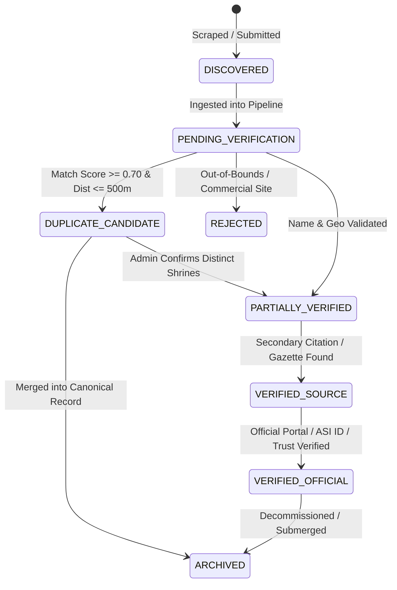

# 🛡️ DEVYATRA — DATA QUALITY ASSURANCE & INGESTION PIPELINE SPECIFICATION

**Document Reference**: `docs/DATA_QUALITY_PLAN.md`  
**Standard**: Non-Fabrication, Source-Backed Provenance, Probabilistic Deduplication  
**Core Maxim**: $$\text{DATA ACCURACY} > \text{RECORD COUNT}$$  
**Author**: Lead Data Engineer, GIS Architect & QA Team  
**Status**: Active Engineering Baseline  

---

## 1. The 10-Stage Verifiable Ingestion Pipeline

To guarantee that no synthetic, hallucinated, or duplicate records ever reach the live discovery platform, all data must flow through a deterministic 10-stage quality pipeline:

```
┌────────────────────────────────────────────────────────────────────────┐
│                        1. OFFICIAL SOURCES                             │
│  State Endowments Boards · ASI Gazetteers · District Admin Registries │
└───────────────────────────────────┬────────────────────────────────────┘
                                    │
                                    ▼
┌────────────────────────────────────────────────────────────────────────┐
│                          2. RAW DATA                                   │
│  Unprocessed CSV / JSON / Excel Extracts with Ingest Timestamps        │
└───────────────────────────────────┬────────────────────────────────────┘
                                    │
                                    ▼
┌────────────────────────────────────────────────────────────────────────┐
│                       3. NORMALIZATION                                 │
│  Unicode NFC Canonicalization · Token Strip · Case & Punctuation Clean │
└───────────────────────────────────┬────────────────────────────────────┘
                                    │
                                    ▼
┌────────────────────────────────────────────────────────────────────────┐
│                    4. GEOGRAPHIC MATCHING                              │
│  State Code ➔ District ➔ Sub-District ➔ Local Settlement Alignment     │
└───────────────────────────────────┬────────────────────────────────────┘
                                    │
                                    ▼
┌────────────────────────────────────────────────────────────────────────┐
│                       5. DEDUPLICATION                                 │
│  Multi-Token Jaro-Winkler · Haversine Proximity (<250m) · Deity Check  │
└───────────────────────────────────┬────────────────────────────────────┘
                                    │
                                    ▼
┌────────────────────────────────────────────────────────────────────────┐
│                    6. SOURCE VERIFICATION                              │
│  HTTP 200 Link Check · ASI Record ID Cross-Reference · Portal Check    │
└───────────────────────────────────┬────────────────────────────────────┘
                                    │
                                    ▼
┌────────────────────────────────────────────────────────────────────────┐
│                      7. QUALITY SCORING                                │
│  Deterministic Algorithm (0–100) based on Field Verification Completeness│
└───────────────────────────────────┬────────────────────────────────────┘
                                    │
                                    ▼
┌────────────────────────────────────────────────────────────────────────┐
│                       8. HUMAN REVIEW                                  │
│  Admin Console Review Queue for Probable Duplicates & Low Confidence   │
└───────────────────────────────────┬────────────────────────────────────┘
                                    │
                                    ▼
┌────────────────────────────────────────────────────────────────────────┐
│                    9. PRODUCTION DATABASE                              │
│  Neon PostgreSQL: Atomic Upsert · Cascade Provenance · Row Audit Logs  │
└───────────────────────────────────┬────────────────────────────────────┘
                                    │
                                    ▼
┌────────────────────────────────────────────────────────────────────────┐
│                   10. CONSUMERS (WEB / API / AI)                       │
│  Strict RAG Grounding · Geospatial Maps · Public REST Discovery        │
└────────────────────────────────────────────────────────────────────────┘
```

---

## 2. The 8-State Verification Lifecycle State Machine

Every record in the platform transitions through explicit lifecycle states. No record may bypass these verification gates.



### State Definitions & Acceptance Criteria

| State | Definition | Display / API Behavior |
| :--- | :--- | :--- |
| `DISCOVERED` | Raw intake row before structural validation. | Hidden from public API and website. |
| `PENDING_VERIFICATION` | Passed coordinate bounding box; awaiting source cross-reference. | Internal review queue only. |
| `PARTIALLY_VERIFIED` | Temple physically exists in district; timings/tickets unverified. | Rendered on site with `"Timings unverified"` banner. |
| `VERIFIED_SOURCE` | Documented in regional gazetteer or academic census. | Public directory active; confidence $\ge 70$. |
| `VERIFIED_OFFICIAL` | Validated by State Endowments Board, ASI, or official trust portal. | Highest ranking; verified badge rendered. |
| `DUPLICATE_CANDIDATE` | Probabilistic engine flagged high similarity with existing shrine. | Frozen; routed to admin curation dashboard. |
| `REJECTED` | Out-of-bounds coords, commercial entity, or non-temple establishment. | Discarded with audit log reason. |
| `ARCHIVED` | Historic duplicate safely merged or decommissioned site. | Soft-deleted; preserved for academic provenance. |

---

## 3. Probabilistic Deduplication Engine Specification

Implemented in [`src/lib/importer/deduplicate.ts`](file:///C:/gokul%20coding/devyatra/src/lib/importer/deduplicate.ts).

### 3.1 Mathematical Distance Metric (Haversine Formula)

For two geodetic coordinates $(\phi_1, \lambda_1)$ and $(\phi_2, \lambda_2)$ in radians:

$$\Delta\phi = \phi_2 - \phi_1, \quad \Delta\lambda = \lambda_2 - \lambda_1$$
$$a = \sin^2\left(\frac{\Delta\phi}{2}\right) + \cos(\phi_1)\cos(\phi_2)\sin^2\left(\frac{\Delta\lambda}{2}\right)$$
$$c = 2 \cdot \text{atan2}\left(\sqrt{a}, \sqrt{1 - a}\right)$$
$$d = R \cdot c \quad \text{where } R = 6,371,000 \text{ meters}$$

### 3.2 Token-Aware String Metric

1. **Stop-Word Removal**: Strips generic structural and honorific words:  
   `["temple", "mandir", "devasthanam", "kovil", "gudi", "shrine", "sri", "shri", "lord", "the", "dham", "peeth", "swamy", "swami"]`
2. **Jaccard Token Overlap**:
   $$J(T_1, T_2) = \frac{|T_1 \cap T_2|}{|T_1 \cup T_2|}$$
3. **Jaro-Winkler Prefix Scaling**:
   $$JW(s_1, s_2) = Jaro(s_1, s_2) + \ell \cdot p \cdot (1 - Jaro(s_1, s_2))$$
   *(where $\ell \le 4$ is the length of common prefix, $p = 0.1$ is the prefix scale)*
4. **Composite Similarity**:
   $$\text{Similarity}(N_1, N_2) = 0.4 \cdot J(T_1, T_2) + 0.6 \cdot JW(\text{sorted}(T_1), \text{sorted}(T_2))$$

### 3.3 Classification Threshold Matrix

| Classification | Haversine Distance | Name Similarity | Administrative Rule | Action |
| :--- | :--- | :--- | :--- | :--- |
| **`EXACT_DUPLICATE`** | $\le 100\text{ meters}$ | $\ge 0.85$ | Same District & State | Route to merge queue |
| **`PROBABLE_DUPLICATE`**| $\le 250\text{ meters}$ | $\ge 0.75$ | Same District & State | Flag in `AuditResult` |
| **`POSSIBLE_DUPLICATE`**| $\le 500\text{ meters}$ | $\ge 0.70$ | Same State | Flag for manual review |
| **`UNIQUE`** | $> 500\text{ meters}$ OR Different State | Any | State Boundary Lock | Ingest as distinct record |

> [!IMPORTANT]
> **State Boundary Lock**: Temples located in different states are **never** auto-merged, even if names and deities are identical (prevents corrupting pan-Indian shrines like Somnath, Kashi Vishwanath, or village Grama Devatas).

---

## 4. Weighted Quality Confidence Scoring ($0–100$)

The confidence score is a deterministic integer ($0–100$) representing factual completeness and verification provenance:

$$\text{Score} = W_{\text{geo}} + W_{\text{source}} + W_{\text{timing}} + W_{\text{booking}} + W_{\text{vernacular}} + W_{\text{history}}$$

| Verification Dimension | Evaluated Criteria | Maximum Points |
| :--- | :--- | :--- |
| **Geographic Accuracy ($W_{\text{geo}}$)** | Surveyed rooftop/gate coordinates ($\ne$ Centroid fallback) | **25 pts** |
| **Institutional Source ($W_{\text{source}}$)** | Verified State Endowments Board, ASI Monument ID, or `.gov.in` portal | **25 pts** |
| **Darshan Schedule ($W_{\text{timing}}$)** | Officially verified opening and aarti hours | **15 pts** |
| **Booking Transparency ($W_{\text{booking}}$)** | Confirmed online ticket portal OR verified free entry counter | **15 pts** |
| **Multilingual Vernacular ($W_{\text{vernacular}}$)**| Native host state script representation (`nameLocal`) | **10 pts** |
| **Documented History ($W_{\text{history}}$)** | Validated dynasty, architectural period, or epigraphical inscription | **10 pts** |

### Confidence Score Tiers

- **High Confidence ($80–100$)**: Fully verified shrine with official portal, surveyed coordinates, and verified timings.
- **Medium Confidence ($60–79$)**: Verified existence and gazetteer citation; approximate rooftop coordinates or unverified timings.
- **Low Confidence ($40–59$)**: Crowdsourced intake or village shrine needing field audit.
- **Needs Verification ($< 40$)**: Incomplete record or quarantined centroid coordinates.

---

## 5. Strict Non-Fabrication Rules

1. **No Synthetic Google Place IDs**: Any Place ID not obtained via official Google Places API lookup is set to `NULL` and flagged `PENDING_LOOKUP`.
2. **No Invented Opening Hours**: If official devasthanam timing is absent, the system displays:  
   *`"Timings not verified with devasthanam trust."`*
3. **No Phantom Ticket Links**: If online VIP booking is not verified, the system displays:  
   *`"Online booking not verified — Consult temple counter."`*
4. **No Centroid Deception**: India centroid (`20.5937, 78.9629`) coordinates are strictly flagged `isCentroidFallback = true` and quarantined from proximity searches.
