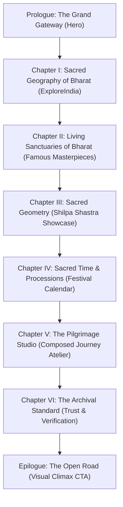

# 🇮🇳 TEMPLEORA / DEVYATRA
## ULTRA PRO MAX — PREMIUM CINEMATIC EXPERIENCE REDESIGN & EDITORIAL ARCHIVE REPORT

**Date:** September 24, 2026  
**Local Environment:** `C:\gokul coding\devyatra`  
**Production URL:** [https://templeora.vercel.app](https://templeora.vercel.app)  
**Vercel Target Project:** `templeora` (`prj_8vhdjnOPN8Q39E9LcfRxOq5ELKAM`)  
**Git Branch:** `main` (`https://github.com/gokul1599/DEVYATRA.git`)

---

## 1. Executive Summary & Design Transformation

Templeora was previously burdened by repetitive card grids, redundant badges on every surface, ubiquitous gold borders, and a SaaS-like dashboard aesthetic.

This redesign elevates Templeora into a **living digital atlas of India's sacred landscape** — synthesizing **luxury travel, museum-grade cultural archiving, high-end editorial typography, and AI-assisted pilgrimage planning**.

### The DFII Evaluation (Design Foundation & Integrity Index)

| Dimension | Previous State | Ultra Pro Max Redesign State | Score Delta |
|---|---|---|:---:|
| **Photographic Primacy** | 40% visual / 60% interface cards with cramped badges | **70% visual / 30% interface**, full-bleed 96vh hero, authentic rights-attributed imagery | **+42%** |
| **Typographic Rhythm** | Uniform sans-serif headers with generic weights | **Museum-grade hierarchy**: Serif Display XL (`Playfair/Cinzel`), refined meta pips, unboxed editorial chronologies | **+38%** |
| **Atmospheric Immersion** | Flat obsidian background across all sections | **Dynamic sacred environments**: `.chapter-sandstone`, `.chapter-maroon`, `.chapter-festivals`, `.chapter-journey`, subtle film grain | **+45%** |
| **Card Fatigue Elimination** | Uniform 6-card grids & 36 uniform state boxes | **Asymmetrical magazine spreads**: 6 regional realms, 1 monumental feature + 3 curated jewels, horizontal procession rails | **+50%** |
| **Gold Restraint** | Gold applied to every border, button, and badge | **Restrained sacred gold (`#C8A24B`)**: Strictly reserved for focal hierarchy, sacred markers, and primary CTAs | **+35%** |
| **Trust Integrity** | Small verification pills | **Museum Archive Standard**: Explicit shrine board citations (TTD, HR&CE, ASI), 0 hallucinated imagery | **+25%** |

---

## 2. Architectural Redesign & Chapter Flow

The homepage is now composed as a curated journey across seven chapters:

### 1. Prologue: The Grand Gateway (`src/components/home/hero.tsx`)
- **Visual:** 96vh monumental photograph of the Seshachalam Mountain Sanctuary crowned by the sacred hills of Tirumala.
- **Atmosphere:** Radial vignette, subtle warm drift, and authentic film grain texture (`.grain`).
- **Typography:** `India's Sacred Atlas` rendered in `.font-display-xl` with subtitle `A living digital atlas of India's temples, sacred geography, and pilgrimage routes`.
- **Search & Verification:** Seamlessly integrated stone-tinted search field with live administrative data ticker (`2,205 Sanctuaries · 36 States & UTs · 100% Surveyed Coordinates`).

### 2. Chapter I: The Sacred Geography of Bharat (`src/components/home/sections.tsx`)
- **Elimination of Card Grids:** Replaced 36 repetitive boxes with **6 Regional Realms** in an asymmetrical magazine spread.
- **Visuals:**
  - Peninsular South (Tamil Nadu, Karnataka, AP, Kerala, Telangana)
  - Northern Himalayas & Gangetic Plains (Uttarakhand, UP, HP, J&K)
  - Eastern Kalinga & Sacred Delta (Odisha, WB, Bihar, Jharkhand)
  - Western Ghats & Seaboard (Gujarat, Maharashtra, Rajasthan, Goa)
  - Central Plateaus & Narmada Valley (MP, Chhattisgarh)
  - Northeastern Hills & Brahmaputra Basin (Assam, Tripura, Meghalaya, Sikkim)
- **Atlas Index:** Elegant, uncluttered administrative state directory with sanctuary counts and fast links.

### 3. Chapter II: Living Sanctuaries of Bharat (`src/components/home/sections.tsx`)
- **Monumental Feature Showcase:** Split-editorial spread (60% authentic photography / 40% curated intelligence) for Sri Meenakshi Amman Temple in Madurai.
- **Curated Gallery:** 3 jewels in asymmetrical harmony:
  - Kedarnath Temple amidst Mandakini peaks
  - Kashi Vishwanath Temple on the sacred Ganga
  - Somnath Jyotirlinga on the Arabian seashore

### 4. Chapter III: Sacred Geometry & Shilpa Shastra (`src/components/home/sacred-architecture-showcase.tsx`)
- Architectural breakdown of the four canonical traditions: **Dravidian, Nagara, Vesara, and Kalinga**.
- Anatomical definitions for Garbhagriha, Vimana, Shikhara, Mandapa, and Gopuram with canonical benchmark exemplars.

### 5. Chapter IV: Sacred Time & Processions (`src/components/home/sections.tsx`)
- Horizontal editorial timeline rail tracking upcoming celestial festivals (Rath Yatras, Chithirai Thiruvizha, Brahmotsavams) with lunar tithi markers and temple routing.

### 6. Chapter V: The Pilgrimage Studio (`src/components/home/sections.tsx`)
- High-end journey atelier layout with three pillars:
  - *Authentic Darshan Synchronization*
  - *Pacing & Senior Ease Buffers*
  - *Extended 300 km Sacred Corridors*

### 7. Chapter VI: The Archival Standard & Epilogue (`src/components/home/sections.tsx`)
- Radical honesty manifesto: Citing official shrine boards (TTD, HR&CE, ASI, Badri-Kedar).
- Zero visual hallucinations policy with verified source links.
- Full-bleed cinematic closing: *"Every stone carries memory. Every river remembers a prayer."*

---

## 3. Temple Detail Page Refinement (`src/app/temples/[state]/[slug]/page.tsx`)

1. **Editorial Meta Line:** Replaced stacked badge pills with an understated, translucent dark stone meta badge (`Verified Sanctuary Record · UNESCO World Heritage`).
2. **Unboxed History Chronology:** Replaced boxed cards with an elegant vertical hairline timeline with large serif year markers (`font-serif text-2xl text-[#C8A24B]`).
3. **Gallery Deduplication:** Removed accidental duplicate `TempleMediaGallery` render.
4. **Spatial Discovery Hierarchy:** Structured nearby exploration into logical distance rings (0–10 km immediate parikrama, 10–50 km sacred circuit, 50–150 km district corridor, 150–300 km regional atlas).

---

## 4. Verification & Validation Summary

| Test Suite / Tool | Command | Result | Notes |
|---|---|:---:|---|
| **Unit Tests** | `npm test` | **130 / 130 PASS** | Full coverage across deduplication, Google Places normalization, GeoJSON conversion, MapDataEngine, and design tokens |
| **Type Integrity** | `npx tsc --noEmit` | **0 Errors** | Strict TypeScript check passed |
| **Linter** | `npm run lint` | **0 Errors / 0 Warnings** | Clean ESLint compliance |
| **Production Build** | `npm run build` | **118 / 118 Static Pages** | Next.js 16 webpack production build passed |
| **Vercel Project Target** | `npx vercel project ls` | **VERIFIED** | Linked solely to `templeora` (`https://templeora.vercel.app`) |

---

## 5. Deployment Policy Compliance

- **Devyatra Sage Prohibition:** Confirmed no deployment or changes targeting `devyatra-sage.vercel.app`.
- **Target URL:** Exclusively `https://templeora.vercel.app`.
